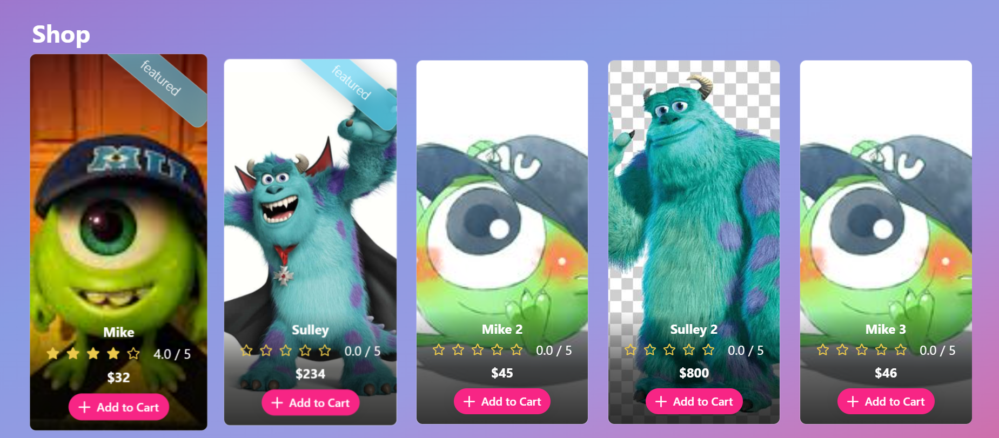
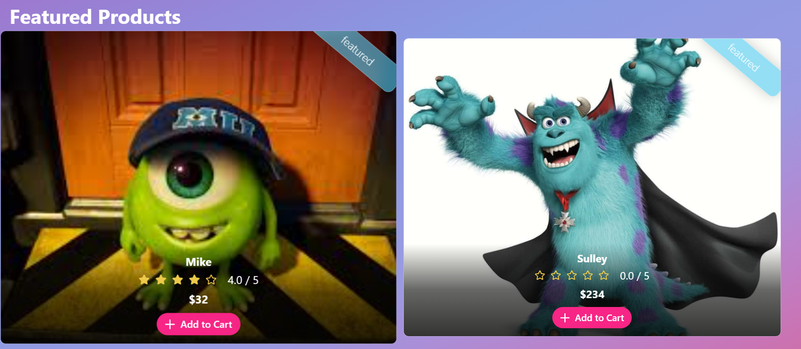
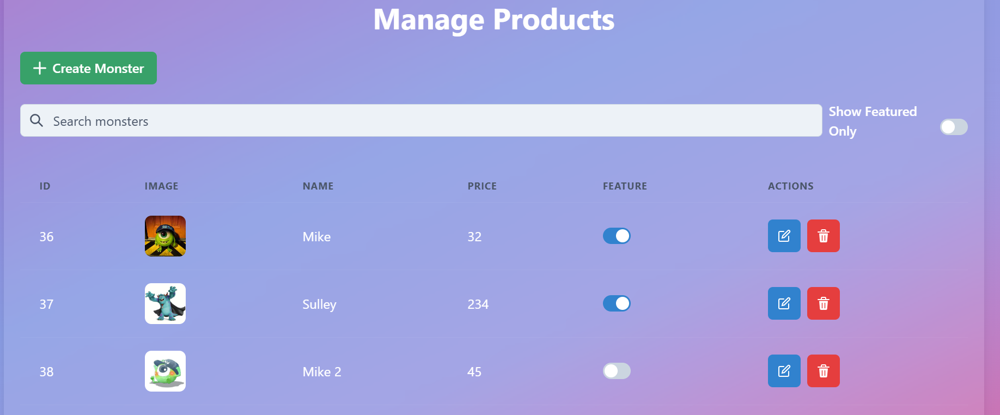

# Monsters Shop

Monsters Shop es una aplicación web para gestionar una tienda de monstruos. Permite a los usuarios ver, crear, actualizar y eliminar monstruos. La aplicación está construida con React y utiliza Vite como herramienta de construcción.

## Características

- Ver una lista de monstruos
- Crear nuevos monstruos
- Actualizar información de monstruos existentes
- Eliminar monstruos
- Interfaz de usuario estilizada con Chakra UI

## Tecnologías Utilizadas

- [React](https://reactjs.org/)
- [Vite](https://vitejs.dev/)
- [Chakra UI](https://chakra-ui.com/)
- [React Router](https://reactrouter.com/)
- [Context API](https://reactjs.org/docs/context.html)

## Instalación

Sigue estos pasos para configurar el proyecto en tu máquina local:

1. Clona el repositorio:
    ```bash
    git clone https://github.com/rcellas/monsters-shop.git
    ```

2. Navega al directorio del proyecto:
    ```bash
    cd monsters-shop
    ```

3. Instala las dependencias:
    ```bash
    pnpm install
    ```

## Uso

Para iniciar la aplicación en modo de desarrollo, ejecuta:
```bash
pnpm run dev
  ```

## Vista Previa






